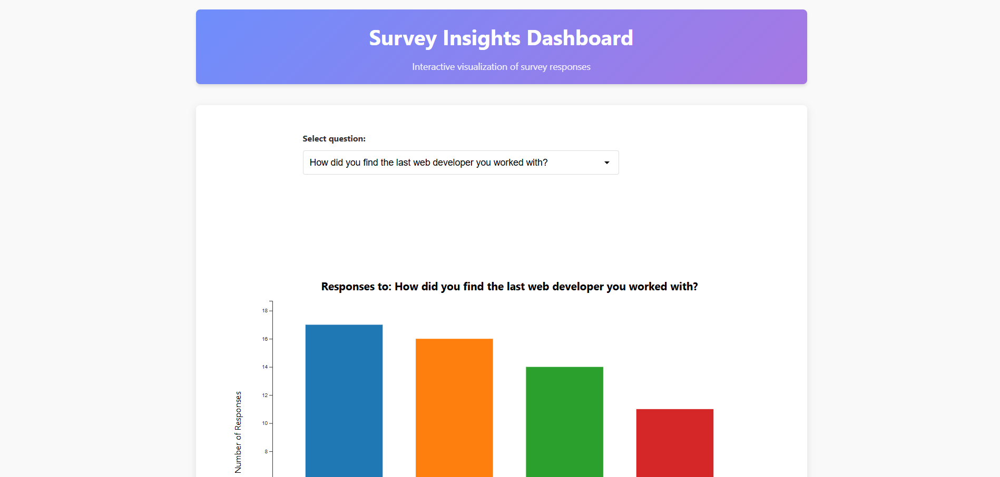

# Survey Insights Dashboard

## Overview

The Survey Insights Dashboard is an interactive data visualization tool designed to transform complex survey data into clear, actionable insights. This application presents survey responses through dynamic, visually engaging charts that help identify patterns, preferences, and trends from respondent feedback.

You can view the page at https://pamulligan.github.io/survey-viz/

## Project Description

This dashboard was developed to address the challenge of analyzing large volumes of survey data effectively. Rather than sifting through spreadsheets or static reports, users can explore survey results through intuitive visualizations that automatically adapt to highlight the most important aspects of each question's responses.

The visualization adapts to different question types, automatically selecting the most appropriate chart format based on the data characteristics. The tool makes survey analysis accessible to both data experts and non-technical stakeholders alike.

## Technologies Used

- **D3.js (v7)** - The core visualization library powering all charts
- **HTML5/CSS3** - Modern, responsive layout and styling
- **JavaScript (ES6+)** - Dynamic interaction and data processing
- **CSV Data Processing** - Flexible data import and transformation
- **Responsive Design** - Optimized for various screen sizes and devices

## Key Features

- **Smart Chart Selection** - Automatically chooses between bar charts, horizontal bar charts, and pie charts based on data characteristics
- **Interactive Visualizations** - Hover effects, tooltips, and animations enhance data exploration
- **Insight Summary** - Key statistics are calculated and displayed automatically
- **Responsive Layout** - Works seamlessly across desktop and mobile devices
- **Filtered Question Set** - Intelligently filters and formats questions for optimal visualization
- **Dynamic Data Processing** - Handles various response formats including multiple-choice, single selection, and comma-separated answers
- **Elegant Transitions** - Smooth animations when switching between questions and chart types

## Getting Started

1. Clone the repository
2. Open the project folder in your preferred code editor
3. Launch with a local server (e.g., Live Server VS Code extension)
4. The dashboard will automatically load the survey data from the CSV file

## Data Format

The dashboard expects survey data in CSV format with:
- Questions as column headers
- Each row representing a survey response
- Support for various answer types including text, numeric, and multiple selection

## Customization

The visualization can be easily customized by:
- Replacing the CSV file with your own survey data
- Adjusting the chart colors and styles in the configuration
- Modifying the filtering criteria for questions

---

Created as part of a project to make survey data more accessible and actionable through effective data visualization.
